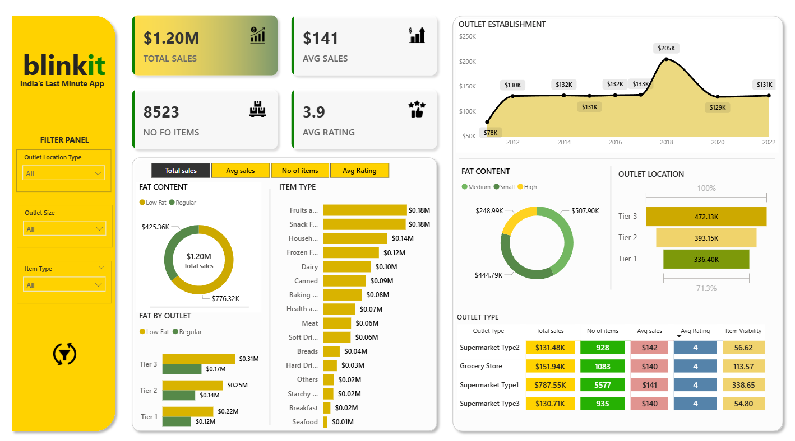

<h1 align="center">🧭 Blinkit Sales Analysis (Excel + SQL + Power BI)</h1>

  <b>An interactive Power BI dashboard powered by SQL-based data cleaning and analysis, uncovering sales trends, outlet performance, and product insights for Blinkit.</b>

  
  
  

<h2>🔗 Table of Contents</h2>
<ul>
  <li><a href="#brief-one-line-summary">🪄 Brief One-Line Summary</a></li>
  <li><a href="#overview">📝 Overview</a></li>
  <li><a href="#problem-statement">❓ Problem Statement</a></li>
  <li><a href="#dataset">📊 Dataset</a></li>
  <li><a href="#tools--technologies">⚙ Tools & Technologies</a></li>
  <li><a href="#methods">🧮 Methods</a></li>
  <li><a href="#key-insights">💡 Key Insights</a></li>
  <li><a href="#dashboard--output">📊 Dashboard / Output</a></li>
  <li><a href="#links">🔗 Project Links</a></li>
  <li><a href="#results--conclusion">📈 Results & Conclusion</a></li>
  <li><a href="#future-work">🚀 Future Work</a></li>
  <li><a href="#author--contact">👤 Author & Contact</a></li>
</ul>

<h2 id="brief-one-line-summary">🪄 Brief One-Line Summary</h2>

An interactive Power BI dashboard integrated with SQL-based data transformations to explore sales, product trends, and outlet performance for Blinkit.

<h2 id="overview">📝 Overview</h2>

This project provides an end-to-end <b>data analytics solution</b> for Blinkit — a quick-commerce delivery platform.
Using <b>PostgreSQL (SQL)</b> for cleaning and transformation and <b>Power BI</b> for visualization, it analyzes sales performance, outlet efficiency, and customer behavior.

The objective is to generate <b>actionable insights</b> to guide business expansion, product strategy, and inventory management.

<h2 id="problem-statement">❓ Problem Statement</h2>

Blinkit aims to understand its sales trends across multiple outlet types, locations, and product categories. The analysis answers key questions:

<ul>
  <li>Which outlet types and tiers generate the most sales?</li>
  <li>How do item categories and fat content affect revenue?</li>
  <li>What impact do customer ratings have on outlet performance?</li>
</ul>

<h2 id="dataset">📊 Dataset</h2>

<b>File:</b> <code>blinkit_data_sample.csv</code> (Sample of first 10 rows)

📄 Full dataset excluded due to size. A 10-row sample is provided to showcase structure and columns.

<table>
  <tr><th>Column Name</th><th>Description</th></tr>
  <tr><td>Item_Fat_Content</td><td>Fat type of the item (Low Fat, Regular)</td></tr>
  <tr><td>Item_Identifier</td><td>Unique product ID</td></tr>
  <tr><td>Item_Type</td><td>Category of the item (Fruits, Dairy, etc.)</td></tr>
  <tr><td>Outlet_Establishment_Year</td><td>Year the outlet was established</td></tr>
  <tr><td>Outlet_Identifier</td><td>Unique store ID</td></tr>
  <tr><td>Outlet_Location_Type</td><td>Tier-based store location</td></tr>
  <tr><td>Outlet_Size</td><td>Store size (Small, Medium, High)</td></tr>
  <tr><td>Outlet_Type</td><td>Type of outlet (Supermarket, Grocery Store, etc.)</td></tr>
  <tr><td>Item_Visibility</td><td>Display percentage of item</td></tr>
  <tr><td>Item_Weight</td><td>Weight of the item</td></tr>
  <tr><td>Sales</td><td>Total sales value</td></tr>
  <tr><td>Rating</td><td>Customer rating</td></tr>
</table>

📘 View Sample Data (First 10 Rows)

| Item_Identifier | Item_Fat_Content | Item_Type  | Outlet_Type       | Sales  | Rating |
|-----------------|------------------|-------------|--------------------|--------|---------|
| FDA15           | Low Fat          | Dairy       | Supermarket Type1 | 3735.1 | 4.1     |
| DRC01           | Regular          | Soft Drinks | Supermarket Type2 | 443.4  | 3.8     |
| FDN15           | Low Fat          | Meat        | Grocery Store     | 2097.3 | 4.2     |
| FDX07           | Regular          | Fruits      | Supermarket Type3 | 732.0  | 4.0     |
| NCD19           | Low Fat          | Snack Foods | Supermarket Type1 | 994.7  | 3.9     |
| FDP36           | Regular          | Frozen Foods| Supermarket Type2 | 1569.6 | 4.1     |
| FDO10           | Low Fat          | Dairy       | Grocery Store     | 210.9  | 3.7     |
| FDN22           | Low Fat          | Breads      | Supermarket Type3 | 1076.9 | 4.3     |
| NCD05           | Regular          | Canned      | Supermarket Type1 | 1193.1 | 4.0     |
| FDW12           | Low Fat          | Health Foods| Supermarket Type2 | 322.5  | 3.8     |

📁 Cleaned using SQL transformations in PostgreSQL.

<h2 id="tools--technologies">⚙ Tools & Technologies</h2>
<table>
  <tr><th>Tool</th><th>Purpose</th></tr>
  <tr><td>PostgreSQL (SQL)</td><td>Data cleaning, transformation, and aggregation</td></tr>
  <tr><td>Power BI Desktop</td><td>Dashboard creation and visualization</td></tr>
  <tr><td>Excel / CSV</td><td>Data input source</td></tr>
  <tr><td>GitHub</td><td>Version control and project hosting</td></tr>
</table>

<h2 id="methods">🧮 Methods</h2>

<h3>1️⃣ Data Cleaning (SQL)</h3>
<ul>
  <li>Standardized inconsistent labels (e.g., <code>LF</code> → <b>Low Fat</b>).</li>
  <li>Removed duplicates and handled missing values.</li>
  <li>Aggregated sales by outlet type, item category, and year.</li>
</ul>

<h3>2️⃣ Data Analysis (SQL)</h3>
<ul>
  <li>Used window functions to calculate total, average, and % sales.</li>
  <li>Identified top-performing outlets and items.</li>
  <li>Summarized yearly trends and outlet performance metrics.</li>
</ul>

<pre><code>
-- Example Query: Total Sales by Outlet Type
SELECT Outlet_Type,
       SUM(Sales)::numeric(12,2) AS total_sales,
       ROUND(SUM(Sales) * 100.0 / SUM(SUM(Sales)) OVER (), 2) AS pct_of_total
FROM blinkit_table
GROUP BY Outlet_Type
ORDER BY total_sales DESC;
</code></pre>

<h3>3️⃣ Visualization (Power BI)</h3>
<ul>
  <li>KPI cards for total, average, and count metrics.</li>
  <li>Bar, donut, and line charts for outlet and category trends.</li>
  <li>Interactive filters and reset button for usability.</li>
</ul>

<h2 id="key-insights">💡 Key Insights</h2>
<ul>
  <li>🏬 Tier 3 outlets achieved the highest sales (~$472K).</li>
  <li>🏪 Supermarket Type 2 outlets performed best in both sales and ratings.</li>
  <li>🧈 Low Fat items slightly outperformed Regular Fat in total revenue.</li>
  <li>📈 2018 was the peak sales year — likely due to expansion or promotions.</li>
</ul>

<h2 id="dashboard--output">📊 Dashboard / Output</h2>

<b>Files:</b>

<ul>
  <li><code>Blinkit_Dashboard.pbix</code> — Power BI dashboard</li>
  <li><code>sql_script/</code> — SQL cleaning and analysis scripts</li>
</ul>

<b>Preview:</b>

<h2 id="links">🔗 Project Links</h2>
<ul>
  <li>📂 <a href="https://github.com/sujal-sadh/blinkit-sales-analysis-excel-sql-powerbi" target="_blank">GitHub Repository</a></li>
  <li>📊 <a href="https://github.com/sujal-sadh/blinkit_sales_analysis_excel_sql_powerbi/blob/main/dashboard/Blinkit_Dashboard.pbix">Power BI File (.pbix)</a></li>
  <li>🧮 <a href="https://github.com/sujal-sadh/blinkit_sales_analysis_excel_sql_powerbi/blob/main/sql_script/sql_script.sql">SQL Script</a></li>
  <li>👤 <a href="https://www.linkedin.com/in/sujal-sadh-9aa902388/">LinkedIn</a></li>
  <li>📧 <a href="mailto:sujalsadh113@gmail.com">sujalsadh113@gmail.com</a></li>
</ul>

<h2 id="results--conclusion">📈 Results & Conclusion</h2>
<ul>
  <li>Tier 3 & Supermarket Type 2 outlets are the most profitable.</li>
  <li>Low Fat items show slightly higher consumer preference.</li>
  <li>Sales peaked in 2018 — likely due to store expansion or promotions.</li>
  <li>Insights support inventory optimization and store growth planning.</li>
</ul>

<h2 id="future-work">🚀 Future Work</h2>
<ul>
  <li>Integrate real-time data updates via APIs.</li>
  <li>Add predictive analytics (DAX or Python forecasting).</li>
  <li>Automate weekly sales reporting via Power BI subscriptions.</li>
  <li>Include customer segmentation & recommendation engine.</li>
</ul>

<h2 id="author--contact">👤 Author & Contact</h2>

<b>Author:</b> Sujal Sadh 
📧 Email: <a href="mailto:sujalsadh113@gmail.com">sujalsadh113@gmail.com</a> 
💼 LinkedIn: <a href="https://www.linkedin.com/in/sujal-sadh-9aa902388/">linkedin.com/in/sujal-sadh-9aa902388</a>

